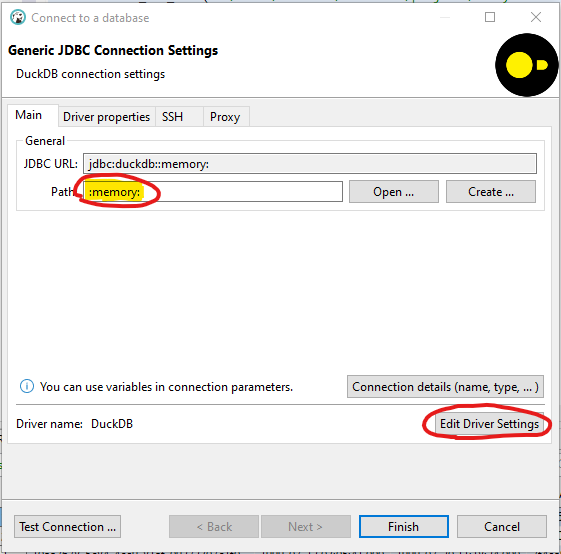
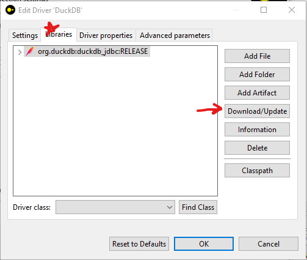

# Setting up duckdb with dbeaver

## setup

1. Install [dbeaver](https://dbeaver.io/download/)
2. Open dbeaver and create a new duckdb connection. Specify `:memory:` as the Path
   
3. Click `Edit Driver Settings` and then install the JDBC drivers: `Libraries` tab -> `Download/Update`
   

## download the data

Download the csv files from the `datasets` directory within this repo.

- you can use `git clone https://github.com/chop-analytics/analyst-take-home-task` or simply download the files from https://github.com/chop-analytics/analyst-take-home-task/datasets`

## test

Now you should be set to run sql queries using dbeaver against the csv data like so:

```sql
select *
    from read_csv_auto('C:/Users/choppy/projects/analyst-take-home-task/datasets/encounters.csv', SAMPLE_SIZE = -1)
```

Be sure to update the file path used in `read_csv_auto` to the filepath where you downloaded the dataset.

## example code

It may be beneficial for performance and code readability to load the csv datasets to tables like so:

```sql
create table encounters as
select *
    from read_csv_auto('C:/Users/choppy/projects/analyst-take-home-task/datasets/encounters.csv', SAMPLE_SIZE = -1);

create table patients as
select *
    from read_csv_auto('C:/Users/choppy/projects/analyst-take-home-task/datasets/patients.csv', SAMPLE_SIZE = -1);
```

Once those tables are created, they can be joined together using standard sql:

```sql
/* encounter count per patient */
select
    patients.id as patient_id,
    count(distinct encounters.id) as encounter_count
from
    patients
    inner join encounters
        on encounters.patient = patients.id
group by
    patients.id
```
