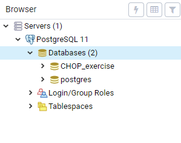
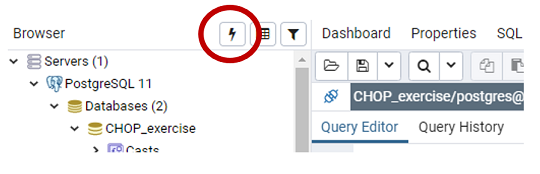
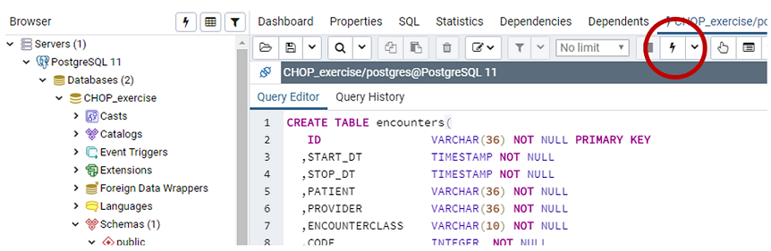
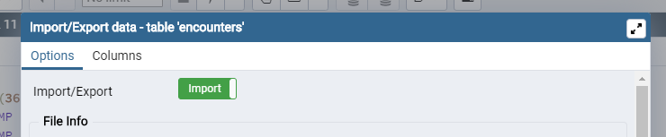
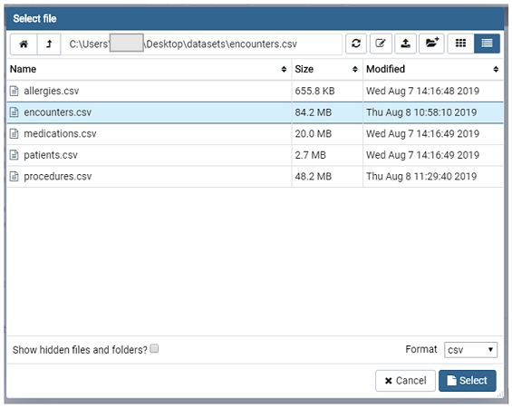
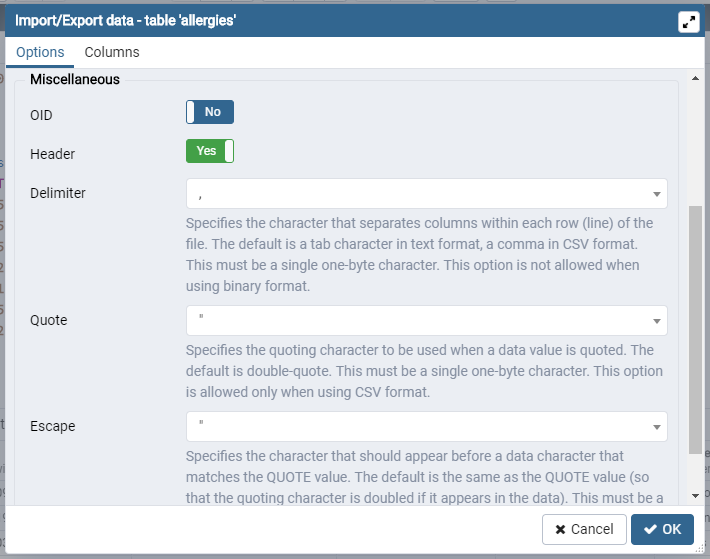
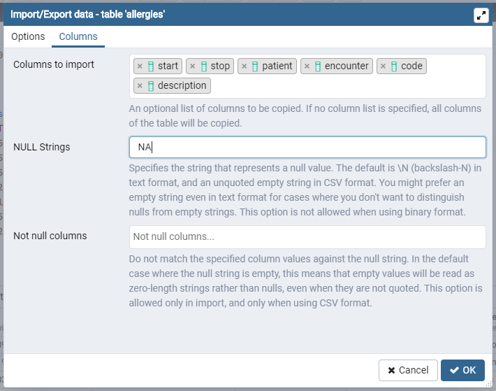

# SQL Setup Guide

This guide provides instructions for installing a local Postgres database.

## Installation

1. [Download the Windows or MacOS Postgres installer](https://www.enterprisedb.com/downloads/postgres-postgresql-downloads)

2. Run the installer and complete installation with default settings.

3. Close the installer once complete (no additional packages required via Stack Builder).

4. Open the `pgAdmin` program.

## Creating the Database and Tables

1. Expand the `Servers` folder in the Browser pane. Right click on `Databases` to create a new Database.
   

1. Open the Query Tool by selecting the lightning bolt on the Browser pane.
   

1. Run the provided [create-tables.sql](create-tables.sql) script.
   

## Importing Data

1. Select a table name from the `Browser` pane (refresh list with right-click) and choose `Import/Export` from the `Tools` drop down. Move slider to `Import`.
   

1. Navigate to the csv file corresponding to selected table.
   

1. Set import options:

   | Field        | Value        |
   | ------------ | ------------ |
   | Header       | Yes          |
   | Delimiter    | Comma        |
   | Escape       | Double-Quote |
   | NULL Strings | NA           |

   
   

1. Repeat import steps for the remaining tables.
